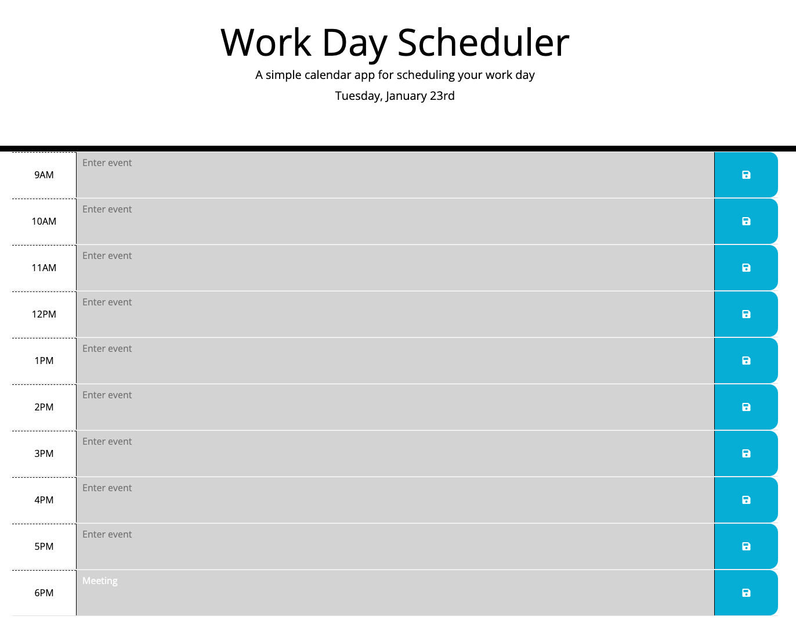

# Daily planner

A calendar application that allows users to save events for each hour of the day

## Description

The project represents an application featuring a work day calendar.

The planner includes:

- The current date at the top of the page
- Timeblocks for 9:00am to 6:00pm business hours
- Color-coded timeblocks based on past (grey), present (red), and future (green) depending on when the timeblock is viewed
- Ability to add and save events in the local storage
- Ability to change events (the new event will replace the old in the local storage)

## Usage

The webpage can be accessed using this URL: to follow

To add an event, the user can tap on the timeblock for the current or future events, add the details of the event and tap on the save button.

Past events can also be edited, however the user will notice that the text color is white to reflect that the time has already past. Current and new events have a black text color.

The screenshots below display an overview of the application.

## Credits

The project was built following the instructions from the materials in the Skills Bootcamp in Front-End Web Development by edX.

In addition, the following resources were used:

1. Tutoring session: logic for the local storage to replace old with new event
2. [Display formats Dayjs](https://day.js.org/docs/en/display/format)
3. Article: [Adding Ordinal Number Suffixes with DayJS](https://codedamn.com/news/javascript/format-dates-with-ordinal-number)
4. Article: [jQuery closest Method](https://www.geeksforgeeks.org/jquery-closest-method/)
5. MDN Web Docs: [Using data attributes](https://developer.mozilla.org/en-US/docs/Learn/HTML/Howto/Use_dta_attributes)
6. Code: [Add message display delay with Query](https://gist.github.com/Korol/2e82b17ad50825ff4f4f2a7545d1e0c1)
7. W3School - [Button Save Icon](https://www.w3schools.com/icons/tryit.asp?icon=fas_fa-save&unicon=f0c7)
8. Markdown badges from [ileriayo](https://github.com/Ileriayo/markdown-badges?tab=readme-ov-file#markdown-badges)

## License

This project is licensed under the terms of the MIT license.

## Badges

